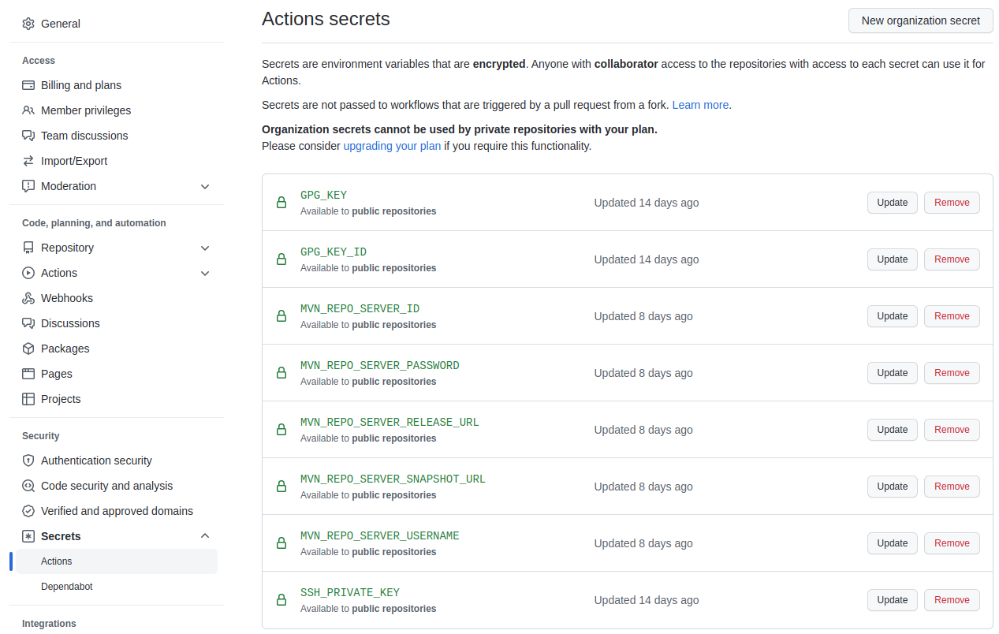

# Organisation setup

## Create a CI Bot

The CI bot is necessary to be able to create a Maven release. The section [Setup a CI bot with GPG signature](https://github.com/gh-a-sample/github-actions-maven-release-sample#setup-a-ci-bot-with-gpg-signature) describes how to create the CI bot.

Important points here are

* [Setup with SSH](https://github.com/qcastel/github-actions-maven-release#setup-with-ssh)
* [Setup a GPG key](https://github.com/qcastel/github-actions-maven-release#setup-a-gpg-key)

After everything has been set up as described, the following Actions-Secrets should be set on the organization.

- `GPG_KEY`
- `GPG_KEY_ID`
- `SSH_PRIVATE_KEY`

## Create account to deploy Maven artifacts to the central Maven repository

The following pages describe how to create an account.

- https://maven.apache.org/repository/guide-central-repository-upload.html
- https://central.sonatype.org/publish/publish-guide/

Once the account has been created, the following action secrets must be set:

```
MVN_REPO_SERVER_USERNAME=[YOUR USERNAME]
MVN_REPO_SERVER_PASSWORD=[USERNAMES PASSWORD]
MVN_REPO_SERVER_ID=ossrh
MVN_REPO_SERVER_SNAPSHOT_URL=https://s01.oss.sonatype.org/content/repositories/snapshots
MVN_REPO_SERVER_RELEASE_URL=https://s01.oss.sonatype.org/service/local/staging/deploy/maven2
```

## Verify Settings

When all points are executed, the organization should contain the following settings:

### Actions secrets


