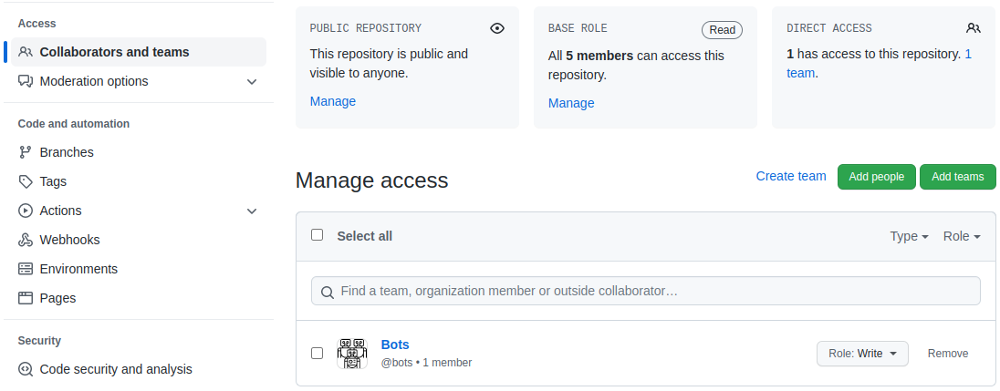
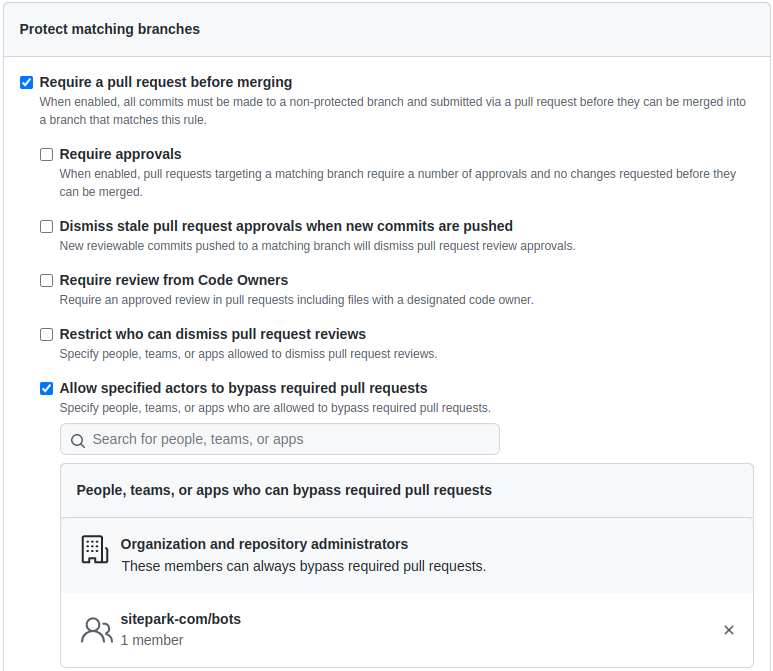

# Project setup

The following are recommended settings of Github projects.

## Manage access

For automated actions, the [`sitepark-com/bots`](https://github.com/orgs/sitepark-com/teams/bots) team must have write access to the project.

## `main`-Branch settings

The default branch should be `main`.

### Branch protection

In the `main` branch should not be committed directly but always via a pull request. For this "Require a pull request before merging" should be set in the "Branch protection rules" to enforce this rule.

For automated actions, an exception must be defined to be able to execute a release process, for example. For this the team [`sitepark-com/bots`](https://github.com/orgs/sitepark-com/teams/bots) is added as an exception.

## GitHub Pages

The git pages should use the `main` branch and be placed in the `/docs` folder.
Images inside the folder `/docs/assets/images`.

## GitHub Actions

To verify and release the projects, GibHub Actions must be defined.

Depending on the type of project (Java/Maven, JavaScript/NPM, PHP/Composer), the corresponding actions must be created here.

### Verify

The verify action is performed on each commit for each branch. The project is built, tested and verified using defined rules such as code style conventions.

### Release

The release action creates a new release for one of the branches `main`, `hotifx/*` or `support/*`. See also [branching model](branching-model.md). This action is project type specific. This is started manually.

### Create GitHub Release Draft

When a new tag of the form `[0-9]+\.[0-9]+\.[0-9]+` has been created, this action is triggered automatically. It creates a new GitLab release as a draft and sets the changelog based on the Git commits.

### Publish Release

This action is started automatically when the GitLab release is published. This action is project type specific. For example, for a Maven project, the artifact is deployed to the central Maven repository.

### Create Hotfix

Creates a hotfix branch by specifying a version tag. This action is project type specific. It is started manually.
