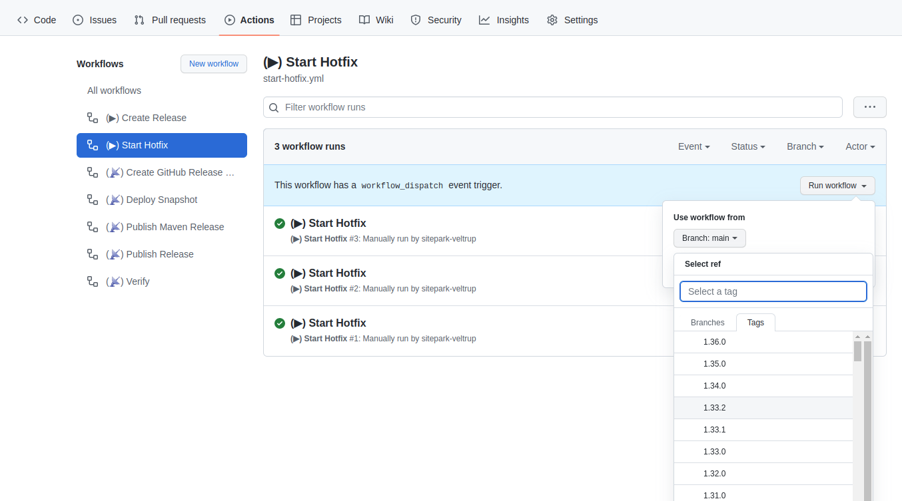

# Start hotfix

To be able to create a hotfix release, a hotfix branch must be created (see also [Branching model](branching-model.md#hotfix)).

Depending on the type of project, there is more to do than just create the branch. For Maven projects, for example, the corresponding version must be entered and committed in `pom.xml`. This task can be done manually or via a Github action "Start Hotfix" provided for this purpose.

With the Github action "Start hotfix" a tag must always be selected. Based on this tag the hotfix branch is created. If a hotfix is to be created on an already existing hotfix version, it must be ensured that the last hotfix version is always selected here. A hotfix always increases only the patch version. The branch name always has the form `hotfix/[major].[minor].x` (e.g. `hotfix/2.4.x`). If the branch already exists, the action is aborted.

When the action is complete, the branch can be checked out locally to apply the fixes. Please note that the changes must also be manually applied to the `main` branch via a `cherry-pick`.

---
**NOTE**

It is important that there is **no** merge from the `hotix` branch to the `main` branch, as it is provided in other branching models.

---

When all changes are included in the `hotfix` branch, the branch can be pushed. The release for this branch is created as described in [Create a release](index.md#create-a-release).